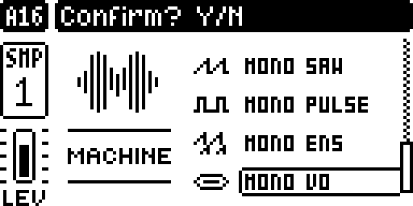
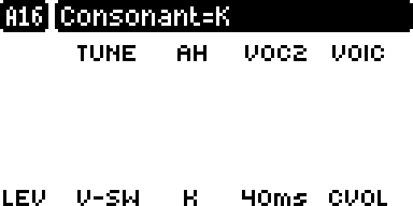
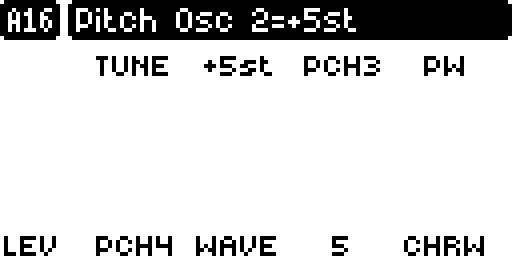
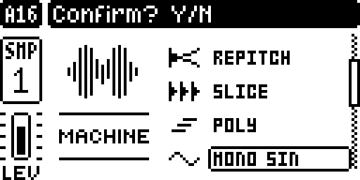

# digi1_mods

*(formerly DT1_8_POLY_OSC)*

Unofficial, community-made mods for the 8-track MK1 sampler groovebox ("DT1"), **OS 1.53 and OS 1.54**: synth machines, an
LFO modulation matrix, scope / spectrum / tuner pages, a master EQ and polyphony. Each is an
[elekloader](https://github.com/irpina/elekloader) mod: you tick the ones you want in elekloader and it builds
your OS file from your own official one.

> **Unofficial and unsupported. Not affiliated with, endorsed by or supported by the hardware's manufacturer.
> Flashing modified firmware is at your own risk.** Read [DISCLAIMER.md](DISCLAIMER.md) and [RISKS.md](RISKS.md) first.

## At a glance

- **Digi Poly**: chords on any audio track, from its own trigs, by borrowing other tracks' voices.
- **Digi Mono**: six synth machines in the FUNC+SRC list (sine, noise, saw, pulse, an ensemble, a formant
  voice), each with its own icon and its own SRC page, values in their units.
- **Digi Matrix**: any track's LFO to any parameter of any track, 8 slots, per pattern.
- **Digi Utilities**: waveform, spectrum and X-Y scope, a tuner and track activity, on a held "...".
- **Digi EQ**: a 4-band master EQ on every output, main outs, headphones and USB.
- **digichain**: SOPHIE, NEIGHBOR, DIGISLICER, Digi Mono and Digi Poly in one build.
- **Ready to use:** the `.elemod` files are in [elemods/](elemods/), built with the latest elekloader: add them
  in elekloader with your own official OS 1.53 or 1.54 file and build (the `-os1.54` files are for 1.54).

<table>
<tr><td align="center"><br><sub>Digi Mono: the machines, with their icons</sub></td>
<td align="center"><br><sub>MONO VO: vowel AH, consonant K, 40 ms</sub></td></tr>
<tr><td align="center"><br><sub>MONO ENS: oscillator 2 at +5 semitones</sub></td>
<td align="center"><br><sub>Digi Matrix: two LFO routings</sub></td></tr>
<tr><td align="center"><br><sub>Digi Utilities: the scope, tuner and track activity</sub></td>
<td align="center"><br><sub>Digi EQ: four bands and the response curve</sub></td></tr>
</table>

## The mods

| mod | what it adds | version | hardware |
|---|---|---|---|
| [Digi Mono](#digi-mono) (`digimono`) | six synth machines: MONO SIN, NOISE, SAW, PULSE, ENS, VO | 0.11 | not yet tested |
| [Digi Matrix](#digi-matrix) (`digimatrix`) | an LFO modulation matrix, 8 cross-track slots | 1.0b | not yet tested |
| [Digi Utilities](#digi-utilities) (`digiutils`) | waveform, spectrum and X-Y pages, tuner, track activity | 1.9a | stand-alone 1.5d confirmed |
| [Digi EQ](#digi-eq) (`digieq`) | a 4-band master EQ on every output | 1.0b | not yet tested |
| [Digi Poly](#digi-poly) (`digipoly`) | POLY: chords from a track's own trigs, borrowing other tracks' voices | 2.0 | not yet tested |
| [digichain](#digichain) (`digichain`) | lets SOPHIE, NEIGHBOR, DIGISLICER and Digi Mono share a build; menu icons | 1.3 | not yet tested |

They all need core 2.1 (elekloader brings it) and combine with each other and with the
[other mods kept up to date](#other-mods-kept-up-to-date) here (digihealth, SOPHIE, NEIGHBOR, DIGISLICER,
DigiFilter): every pair, checked by `tools/dev.sh elemods`. All of them in one build fit too, but for
DIGISLICER (88 KB), which needs a few left out: the mods share 128 KB.

**OS 1.54:** every mod here is built for both 1.53 and 1.54, and on 1.54 they pass the same emulator tests
(Digi Mono, Digi Poly, Digi Matrix, Digi EQ, Digi Utilities' pages, NEIGHBOR through digichain). Of the other
mods, digihealth, NEIGHBOR and DIGISLICER have 1.54 versions; SOPHIE and DigiFilter do not yet, so on 1.54
they are left out until their authors port them. `tools/port_os.py` did the port (docs/DEVELOPING.md).

**Getting them:** download them from [elemods/](elemods/) and add them in elekloader (it brings the core
mod). Or build them yourself: `tools/dev.sh mods` fetches elekloader and the other mods and builds every mod
as an `.elemod` from your own official file (`tools/dev.sh publish` refreshes elemods/); on macOS the elekloader app (`tools/macos/install_app.sh`) does it from
a double-click and checks for updates. Steps: [docs/DEVELOPING.md](docs/DEVELOPING.md). Full controls:
[docs/USAGE.md](docs/USAGE.md). Version history: [CHANGELOG.md](CHANGELOG.md).

<sub>Screens are the unit's 128 x 64 display, captured in an emulator running the mods and scaled 4x; the
pattern is renamed "DEMO". Only screenshots are published here - no firmware, and nothing derived from it.</sub>

## Digi Mono

**Digi Mono** (elekloader mod `digimono`, 0.11, needs core 2.1 and digichain) - six synth machines after the Monomachine
- **Six new machines in the FUNC+SRC list**, each with its own icon: **MONO SIN**, **MONO NOISE** (sample and
  hold, red noise), **MONO SAW** (unison, two sub-oscillators), **MONO PULSE** (PWM, unison, subs), **MONO ENS**
  (four oscillators at set intervals, saw to pulse, chorus) and **MONO VO** (a formant voice: vowel to vowel,
  consonants). They need no sample; the track's filter, amp, LFOs, sends and p-locks work on them as on a
  sample.
- **Their own SRC page**: knobs B-H are the machine's parameters, named and shown in their own units
  (semitones, %, ms, vowels, consonants). A stays TUNE; D is a parameter too (no sample list), and the
  volume is the track's LEVEL and AMP page.
- **Tick it in elekloader** and digichain is ticked with it; it combines with every other mod here, Digi Poly
  included, and with digisophie, digineighbor and digislicer (their `-chain` builds).
- **Light enough for a few tracks at once**: 0.10 and 0.11 made VO 16-19 % and ENS 20-29 % lighter (ENS starts with its chorus
  off, CHRL 0: the chorus is its costliest part). On a unit
  the stock render already takes about 80 % of each block, so keep to a few playing Digi Mono tracks
  (VO, ENS and PULSE cost the most) and check with digihealth's SYSTEM INFO; [docs/USAGE.md](docs/USAGE.md)
  has the knobs and a load test.
- A clean-room engine: no Monomachine code or data. Checked in emulation on the real firmware, bit for bit
  (tests/digiemu_mono.py); **not yet on a unit**. Details: [mods/digimono/DESIGN.md](mods/digimono/DESIGN.md).

<table><tr><td align="center"><br><sub>A MONO VO track's SRC page: each knob shows its value in place, the top bar its full name</sub></td><td align="center"><br><sub>MONO ENS: PCH2 at +5 semitones, CHRL at 5</sub></td></tr></table>

## Digi Matrix

**Digi Matrix** (elekloader mod `digimatrix`, 1.0b) - a modulation matrix for the LFOs
- **SETTINGS > MOD MATRIX** opens a page with **8 routing slots**. Each one sends **any track's LFO1 or LFO2**
  to **any parameter of any track**, with **its own depth** (-64..+64) - so one LFO can drive several
  parameters across several tracks, each by a different amount, while its own DEP keeps controlling only its
  own track.
- Per slot, **OWN** says whether that LFO still modulates its own track's DEST as well, or only what the
  matrix routes it to.
- UP/DOWN choose a slot, **YES** turns it on and off, **NO** leaves; knobs A-F edit the slot under the cursor
  (source track, source LFO, destination track, destination parameter, depth, OWN).
- The matrix lives in the pattern's kit, so **each pattern has its own**; it is saved with the project and
  (since 2.0d) survives a power cycle.

<table><tr><td align="center"><br><sub>SETTINGS &gt; MOD MATRIX: two slots routed, the second under the cursor</sub></td></tr></table>

## Digi Utilities

**Digi Utilities** (elekloader mod `digiutils`, 1.9a) - the utility page, on a **held "..."** (three dots) key:
waveform -> spectrum -> X-Y; Song mode is kept.


- *Scope*: live waveform. *Spectrum*: 30 Hz..20 kHz analyser (128 log columns, 60 dB, falling peaks;
  bass from a 170 ms window, highs from a 21 ms window).
- Both pages:
  - main view -> X-Y (stereo goniometer) -> close, with the same key. **YES** = fullscreen, **NO** = close.
  - bottom-right: activity boxes for all 8 audio tracks (flash on trig; POLY voices stay lit while held).
  - bottom-left: **tuner** (note + cents, ~12 Hz..3 kHz).
  - the top bar (pattern, name, tempo), mutes, pattern/bank change, page keys and **knobs** all keep working
    while the page is open, so you can tweak a sound and watch it change.

## Digi EQ

**Digi EQ** (elekloader mod `digieq`, 1.0b) - a 4-band master EQ, on **every output**
- A master page (FUNC+LFO, after Compressor): 4 bands, each with level/Q (knobs A-D, press to switch) and
  frequency/type (knobs E-H, press to switch: HP, low shelf, bell, notch, band pass, high shelf, LP), with the
  response curve drawn above the knobs.
- It runs on the **master mix**, before the render hands it to the analog outputs and to the USB stream, so
  main outs, headphones and USB audio all carry it - as the compressor does. (Up to 1.8a it sat on the
  codec's transmit buffer, which is the analog path only, so USB audio came out unequalized.)
- **Per pattern**: the settings live in the pattern's kit, so every pattern has its own EQ, saved with the
  project and kept over a power-off.
- **SETTINGS > GLOBAL FX/MIX > MASTER EQ**, beside the firmware's own entries: with it on, the EQ you can hear
  overrides every pattern's own; with it off, each pattern goes back to its own.

<table><tr><td align="center"><br><sub>The master EQ page: four bands and the response curve</sub></td><td align="center"><br><sub>SETTINGS &gt; GLOBAL FX/MIX: the MASTER EQ entry, on</sub></td></tr></table>

## Digi Poly

**Digi Poly** (elekloader mod `digipoly`, 2.0, needs core 2.1 and digichain) - the POLY machine, redesigned.
2.0 runs on core 2.1, so it shares a build with every other mod here, Digi Mono included. POLY is now machine
6 (it was 4, which core 2.1 gave NEIGHBOR): a POLY track saved with 1.0f loads as NEIGHBOR or ONESHOT, so
choose POLY on it again.
- Any audio track set to POLY plays **chords from its own trigs**: its TRIG page becomes the MIDI tracks' page
  (NOT1-NOT4 piano roll, VEL, LEN, PROB, LFO.T, with the track's LEV fader); SRC, FLTR, AMP and LFO are as usual.
- Each extra note **borrows the voice of another track** (the one idle longest; never a muted track, a track
  that trigs at the same moment, or a track you took out of the pool). No MIDI track or loopback is needed.
- **Pressing the track's key plays the chord**; notes on the POLY track's **own MIDI channel** play
  polyphonically, one voice per note, and **recording them writes the chord into the piano roll** - up to
  four notes into the step's NOT1-NOT4, where the stock OS would record a bare trig with no note.
- On the POLY track's TRIG page the **LEVEL knob sets the track level** and the **LEV fader** beside NOT1
  shows it, the same size and in the same place as on the audio pages.
- The POLY track's **level and knobs apply to the whole chord**, borrowed voices included.
- **SETTINGS > POLY** chooses which tracks lend their voice. It lives in the pattern's kit, so each pattern has
  its own voice allocation and it is saved with the project.
- Several tracks can be POLY. POLY survives kit/project reload, and since 2.0d the pool survives a power cycle.

<table><tr><td align="center"><br><sub>FUNC+SRC: POLY after SLICE, with its icon, then Digi Mono</sub></td><td align="center"><br><sub>A POLY track's TRIG page: NOT1-NOT4 piano roll and the LEV fader</sub></td></tr><tr><td align="center"> POLY"><br><sub>SETTINGS &gt; POLY: track 2 taken out of this pattern's voice pool</sub></td></tr></table>

**POLY in the stand-alone builds** (and the earlier `dt8poly` mod, built only on request) - a 5th sample machine
in the FUNC+SRC list
- Tracks set to POLY share one voice pool; the lowest POLY track is the *control* track (its sound is used).
- Sequencer trigs on the control track rotate across the POLY tracks.
- *MIDI cable*: notes and chords from a MIDI track (e.g. recorded from an external sequencer) play the POLY
  tracks whose MIDI receive channel equals the MIDI track's output channel - free voice first, else oldest.
- CCs from that MIDI track reach the POLY tracks (filter/amp sequencing); SRC TUNE and LFOs stay per voice.
- POLY survives kit/project reload.

## digichain

**digichain** (elekloader mod `digichain`, 1.3, needs core 2.1) - one build for the SRC machine mods
- SOPHIE (digisophie), NEIGHBOR (digineighbor) and DIGISLICER (digislicer) each patch the same places in the
  SRC page and the render; digichain owns those places once and passes each call to the machine it is for, so
  they combine with each other and with Digi Mono. `tools/dev.sh` builds their `-chain` versions for it.
- Every added machine gets its own icon in the FUNC+SRC list (the firmware drew only the first).
- A new NEIGHBOR track takes the track on its left as its source, and its SLOT runs 0-8.
- Ticked automatically with Digi Mono or a `-chain` mod. Details: [mods/digichain/README.md](mods/digichain/README.md).

## Other mods kept up to date

`tools/dev.sh mods` (and the elekloader app's update button) also fetches and builds these, by other authors,
from their own repositories, so one update brings everything: **digihealth** (FAST AUDIO, SYSTEM INFO CPU/DSP
readout), **SOPHIE** (digisophie), **NEIGHBOR** (digineighbor), **DIGISLICER** (digislicer) and **DigiFilter**.
`COMPATIBILITY.txt`, written next to the `.elemod` files, says which pairs combine.

## Stand-alone builds

Before elekloader, this project was a patch set built straight onto the official file, POLY with one utility
page per build:

| page on the "..." key | release | unit shows | hardware |
|---|---|---|---|
| Scope (waveform) | v3p | 1.5b | not yet tested |
| Spectrum | v3q-spectrum | 1.5c | not yet tested |
| All three views (waveform, spectrum, X-Y) | v3r-all | 1.5d | **confirmed** |

**Song mode** is disabled in the stand-alone builds (its code space is reused); chains still work. Digi
Utilities keeps Song mode: the page opens on a held "..." instead.

**Build it yourself** from your own copy of the official OS 1.53 file (recommended; identical result):

```sh
# get the MIT-licensed .syx container tool by mischa85 (GitHub) and build it with `make`, then:
python3 tools/build.py --official <official OS 1.53 .syx> --tool <path to the container tool> --page scope
# -> out/digi1_mods_v3p_1.5b.syx            SHA-256 f8cd0d721c265a07077078a5aae95908c265ce3fadd0c83cbbb377916b51b8b3
python3 tools/build.py --official <official OS 1.53 .syx> --tool <path to the container tool> --page spectrum
# -> out/digi1_mods_v3q-spectrum_1.5c.syx   SHA-256 3aeb2bb8c4a79c7a807d4ee62336ba8e045078d6ae3d122d64e53a0c8851564a
```

The build refuses any input that is not the exact official OS 1.53 file and checks every patched byte.
Flashing and **reverting**: [docs/INSTALL.md](docs/INSTALL.md).

## Developing

`tools/dev.sh` runs the whole loop on your own computer:

- **setup** (once): elekloader, the digiemu emulator and the pinned helper mods;
- **test**: the synth engine;
- **build**: your OS file from your own official OS;
- **emu, emutest**: boot the build in digiemu and check every Digi Mono machine there, bit for bit;
- **play**: open digiemu's window to play the build yourself.

Steps, per operating system: [docs/DEVELOPING.md](docs/DEVELOPING.md).

## Building as elekloader mods (by hand)

`tools/dev.sh mods` is the easy path. By hand:

```sh
python3 tools/build_elemods.py --stock <official OS 1.53 .syx> --elekloader <elekloader checkout>
# -> out/elk/{digipoly,digiutils,digimatrix,digieq}/out/*.elemod
```

Then add them in elekloader's window (with its core mod), or on the command line:
`python -m elekloader.patch --stock <official .syx> --mod core-2.1.elemod --mod digichain-1.4.elemod --mod digipoly-2.0.elemod --mod digimatrix-1.0b.elemod --mod digieq-1.0b.elemod --out custom.syx --version 2.0e`.
Add `--mod digiutils-1.9a.elemod` for the "..." utility pages.
The mods need m68k binutils to build. This repo's own `.elemod` files are also in [elemods/](elemods/) (`tools/dev.sh publish`): they hold the mods' code, and refer to your own official file for anything from the firmware.

The master EQ is in the elekloader build only; since 1.0a it is its own mod, `digieq`
([docs/USAGE.md](docs/USAGE.md)).

Checked in emulation (hardware: **not yet** for Digi Poly): the linked Digi utilities / dt8poly code is
instruction-for-instruction the stand-alone code (`tests/elk_equiv.py`); the mods lint and link alone, together,
and with digihealth + digislicer; a full walk-through boots in the digiemu emulator with FAST AUDIO on
(`tests/digiemu_scenario.py`); Digi Poly is checked twice: `tests/emu_poly.py` runs its own code in unicorn
without booting the firmware (voice choice, the settings row, the chord's messages, the knob and level mirroring,
the TRIG page's fader - seconds), and `tests/digiemu_poly.py` boots the firmware for what only it can show (the
page, the key's chord, chords while the sequencer runs, per-pattern pools). Digi Matrix is checked the same
way: `tests/emu_matrix.py` runs both engine passes, the clamps and the whole page in unicorn in seconds, and
`tests/digiemu_matrix.py` boots the firmware to show the SETTINGS row, the page, what its keys and knobs write
into the pattern's kit, and one track's LFO actually moving another track's parameter. Digi EQ likewise:
`tests/emu_eq.py` checks the knobs against the design model, the audio bit for bit against it, and the
settings in the kit and the global override; `tests/digiemu_eq.py` boots the firmware and measures a test
tone put into the master mix again in the bus the USB stream is built from, against what the model says the
settings should do. Differences from the stand-alone
build: the code runs from the loader's RAM area instead of reclaimed song-mode code, and the audio tap sits one
instruction later because FAST AUDIO owns the output-write call (see docs/TECHNICAL_NOTES.md).

## Repository layout

| path | contents |
|---|---|
| `src/` | assembly for every hook (ColdFire, GNU as `-mcpu=5475`) |
| `bin/` | the assembled hooks (committed; `make` rebuilds them) |
| `tools/build.py` | official .syx -> patched .syx, fully verified |
| `tools/patch_section3.py` | applies all patches to the MAIN OS section |
| `elemods/` | this repo's mods as ready-made `.elemod` files, for elekloader |
| `mods/`, `tools/build_elemods.py` | the elekloader mods (mod.json + mod-only sources; shared code from `src/`) |
| `tests/` | emulator tests: the real firmware code runs under unicorn with the patches (`tests/run_tests.sh <official s3> <patched s3> scope|spectrum`) |
| `docs/` | install/revert, usage, technical notes (reverse-engineering log) |

No firmware from the manufacturer is stored or distributed here; see [DISCLAIMER.md](DISCLAIMER.md).

## License

Our own code and docs: MIT ([LICENSE](LICENSE)). This does **not** cover the manufacturer's firmware.
